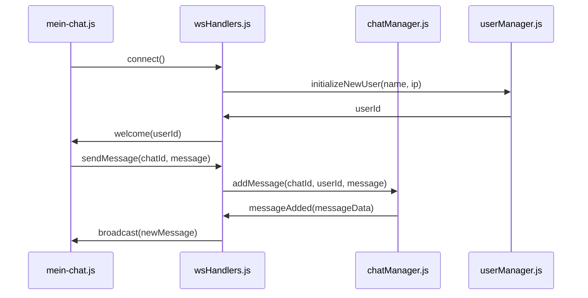
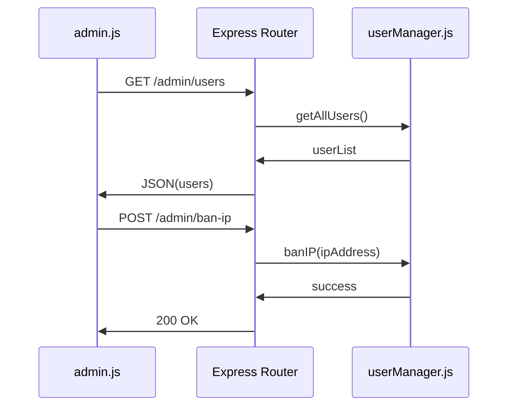
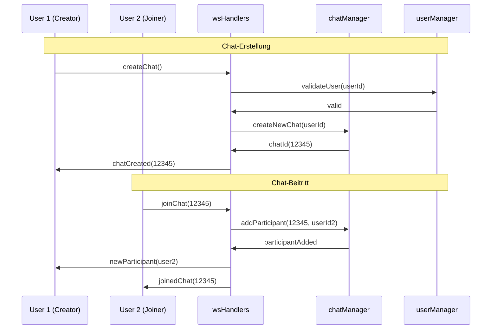
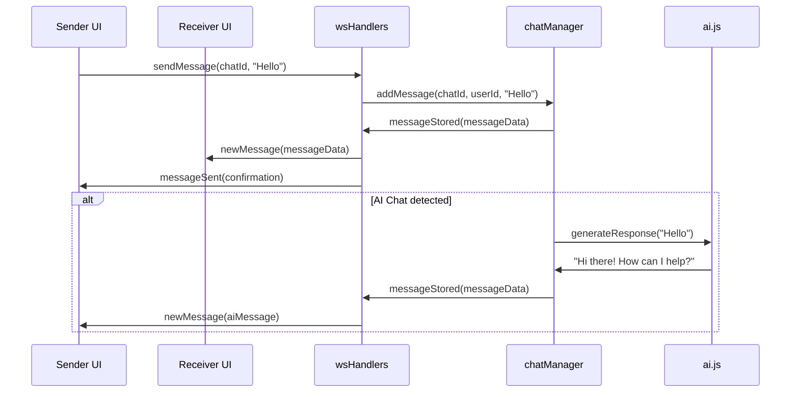
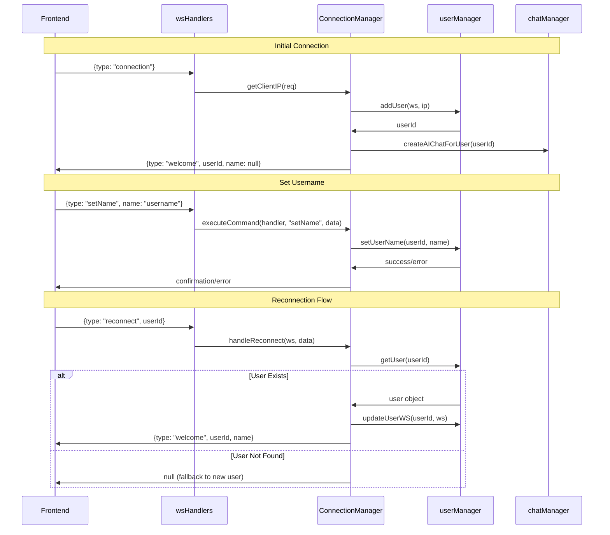
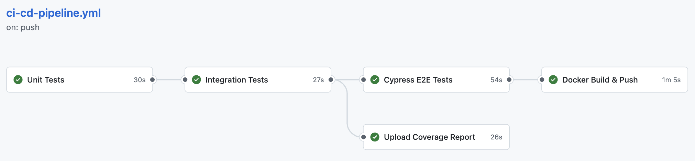

# Chat Tool – Entwicklerdokumentation

# Übersicht & Zielsetzung

Diese Dokumentation richtet sich an Entwickler und erläutert die Architektur, Kommunikationsmuster und Sequenzabläufe der Chat-Anwendung. Sie dient dazu, das System verständlich zu machen, gezielt zu erweitern oder zu debuggen.  
**Ziel:** Es wird erklärt, wie die Komponenten miteinander kommunizieren, wie typische Abläufe und Sequenzen im Projekt aussehen und wie die technische Umsetzung strukturiert ist. Die Diagramme werden jeweils durch erläuternden Text ergänzt, um die Zusammenhänge und die Motivation hinter dem Design zu verdeutlichen.

---

## Systemarchitektur

Die folgende Dokumentation gibt einen schnellen Überblick über die beteiligten Komponenten, deren Zusammenspiel und die wichtigsten Abläufe.


### High-Level Architektur

Das nachfolgende Architekturdiagramm zeigt die wichtigsten Systembestandteile und deren Beziehungen. Die Anwendung ist in Frontend, Backend und optionale externe Dienste (z.B. KI-Service) unterteilt.

```
┌─────────────────┐    ┌─────────────────┐    ┌─────────────────┐
│   Frontend      │    │   Backend       │    │   External      │
│                 │    │                 │    │                 │
│ ┌─────────────┐ │    │ ┌─────────────┐ │    │ ┌─────────────┐ │
│ │ mein-chat.js│ │◄──►│ │ wsHandlers  │ │    │ │ AI Service  │ │
│ │ (Component) │ │    │ │  (Router)   │ │    │ │ (Optional)  │ │
│ └─────────────┘ │    │ └─────────────┘ │    │ └─────────────┘ │
│                 │    │        │        │    │                 │
│ ┌─────────────┐ │    │ ┌─────────────┐ │    │                 │
│ │   admin     │ │◄──►│ │ chatManager │ │◄──►│                 │
│ │   (Page)    │ │    │ │  (Logic)    │ │    │                 │
│ └─────────────┘ │    │ └─────────────┘ │    │                 │
│                 │    │        │        │    │                 │
│                 │    │ ┌─────────────┐ │    │                 │
│                 │    │ │ userManager │ │    │                 │
│                 │    │ │   (Auth)    │ │    │                 │
│                 │    │ └─────────────┘ │    │                 │
└─────────────────┘    └─────────────────┘    └─────────────────┘
```

**Erläuterung:**  
Das Architekturdiagramm verdeutlicht die Aufteilung in Frontend, Backend und optionale externe Dienste.  
- Das **Frontend** besteht aus der Chat-Komponente (`mein-chat.js`) für die Nutzerinteraktion und einer optionalen Admin-Seite.
- Das **Backend** übernimmt die zentrale Logik:  
  - `wsHandlers` dient als WebSocket-Router für die Kommunikation mit Clients.  
  - `chatManager` verwaltet Chat-Räume und Nachrichten.  
  - `userManager` ist für Benutzerverwaltung und Authentifizierung zuständig.  
- Der **externe KI-Service** (z.B. Google Gemini) ermöglicht die Nutzung eines KI-gestützten Chats.

---

### Systemübersicht

| Komponente        | Verantwortlichkeit                        | Kommunikation                  |
|-------------------|-------------------------------------------|-------------------------------|
| **mein-chat.js**  | UI-Rendering, Event-Handling, WebSocket-Client | WebSocket zu wsHandlers        |
| **admin.js**      | Admin-Interface, Benutzerverwaltung       | REST-API zu Express            |
| **wsHandlers.js** | WebSocket-Message-Router                  | WebSocket ↔ Manager-Module     |
| **chatManager.js**| Chat-Logik, Nachrichten-Verwaltung        | In-Memory Storage              |
| **userManager.js**| Benutzer-Sessions, IP-Banning             | In-Memory Storage              |
| **ai.js**         | KI-Integration für Chatbots               | HTTP zu externen APIs          |

Diese Tabelle gibt einen Überblick über die wichtigsten Dateien und deren Aufgaben. Die Kommunikation erfolgt entweder über WebSockets (für Chat-Funktionalität) oder REST (für Admin-Funktionen).

---

## Kommunikationsmuster

Die folgenden Sequenzdiagramme zeigen die wichtigsten Kommunikationsabläufe zwischen den Komponenten. Sie helfen zu verstehen, wie Nachrichten, Benutzeraktionen und Admin-Operationen im System verarbeitet werden.  
**Hinweis:** Jedes Diagramm wird durch einen erklärenden Text begleitet, der die Abläufe und die Motivation hinter dem Design erläutert.

### 1. WebSocket-Kommunikation (Frontend ↔ Backend)

Dieses Diagramm beschreibt, wie ein Benutzer über die Chat-Komponente mit dem Backend kommuniziert. Die WebSocket-Verbindung ermöglicht Echtzeitübertragung von Nachrichten.



**Erläuterung:**  
- Nach dem Verbindungsaufbau wird ein neuer Benutzer initialisiert.
- Nachrichten werden über den `chatManager` verarbeitet und an alle Teilnehmer verteilt.
- Die Architektur ermöglicht eine klare Trennung zwischen Routing, Logik und Benutzerverwaltung.

---

### 2. REST-API-Kommunikation (Admin ↔ Backend)

Das folgende Diagramm zeigt, wie die Admin-Seite mit dem Backend interagiert, um Benutzer zu verwalten oder IPs zu sperren.



**Erläuterung:**  
- Die Admin-Oberfläche nutzt REST-Endpunkte, um Benutzerlisten abzurufen oder IP-Adressen zu sperren.
- Die Trennung von WebSocket- und REST-Kommunikation sorgt für eine klare Verantwortlichkeit im Backend.

---

## Sequenzdiagramme

Die folgenden Diagramme zeigen typische Abläufe im System, z.B. das Erstellen/Beitreten von Chats, die Nachrichtenübertragung und die Authentifizierung.  
**Jedes Diagramm wird durch einen erläuternden Text ergänzt, um die jeweiligen Abläufe und Designentscheidungen zu verdeutlichen.**

### Chat-Erstellung und Beitritt



**Erläuterung:**  
- Ein Benutzer kann einen neuen Chat erstellen, der vom Backend verwaltet wird.
- Weitere Benutzer können dem Chat beitreten, wobei alle Teilnehmer informiert werden.

---

### Nachrichtenübertragung



**Erläuterung:**  
- Nachrichten werden in Echtzeit an alle Teilnehmer verteilt.
- Bei KI-Chats wird nach dem Absenden automatisch eine Antwort vom KI-Service generiert und zurückgesendet.

---

### Benutzer-Authentifizierung



**Erläuterung:**  
- Die Authentifizierung erfolgt beim Verbindungsaufbau über die IP-Adresse.
- Benutzer können ihren Namen setzen und sich bei Verbindungsabbruch wieder anmelden.
- Das System erkennt, ob ein Benutzer bereits existiert, und stellt die Session ggf. wieder her.

---

## Deployment

### CI/CD-Pipeline-Flow



Das Deployment der Chat-Anwendung ist automatisiert und folgt dem in der Abbildung dargestellten CI/CD-Ansatz mittels GitHub-Actions.

1. **Automatisierte Tests:**  
   Bei jedem Push auf dem Main-Branch werden zuerst die Unit-Tests, dann die Integrationstests und anschließend die End-to-End-Tests (Cypress) ausgeführt. Dies stellt sicher, dass neue Änderungen keine bestehenden Funktionen brechen.

2. **Testabdeckung:**  
   Nach den Unit- und Integrationstests wird automatisch ein Coverage-Report erstellt und auf GitHub-Pages ([Link zum Coverage-Report](https://verteilte-systeme-wwii23.github.io/Chat/)) hochgeladen, um die Testabdeckung kontinuierlich zu überwachen.

3. **Containerisierung:**  
   Nach erfolgreichem Testlauf wird die Anwendung mit Docker gebaut. Das gebaute Docker-Image wird in ein Container-Registry (GitHub Container Registry) gepusht. Dadurch kann es einfach auf beliebigen Servern oder in der Cloud bereitgestellt werden.

4. **Bereitstellung:**  
   Das Image wird schließlich auf dem Zielserver (DHBW-Server) mittels eines Docker-Compose, bestehend aus dem Chat-App-Image und Watchtower bereitgestellt. Dabei wird ein Polling alle 60s für das neue Image durchgeführt.

---