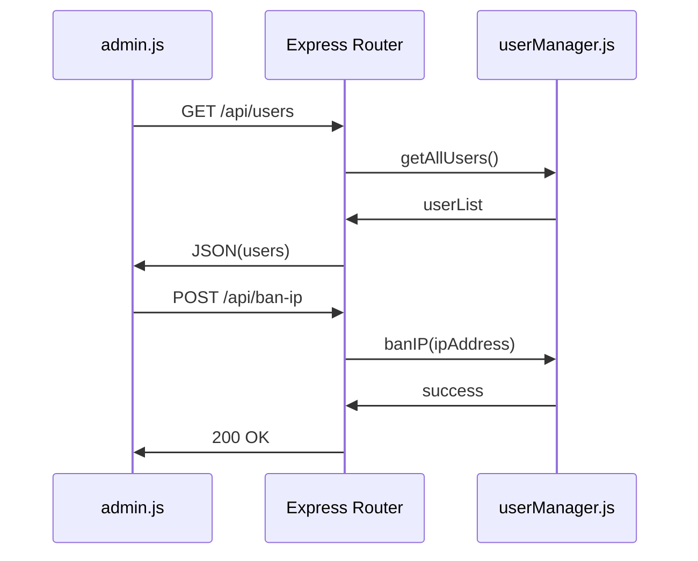
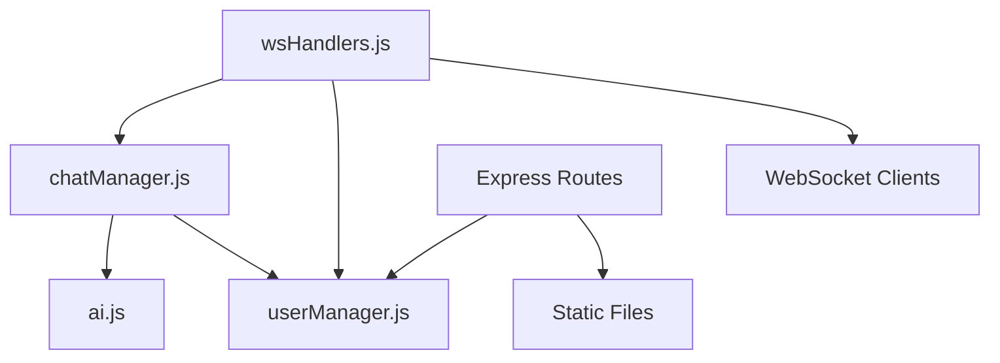
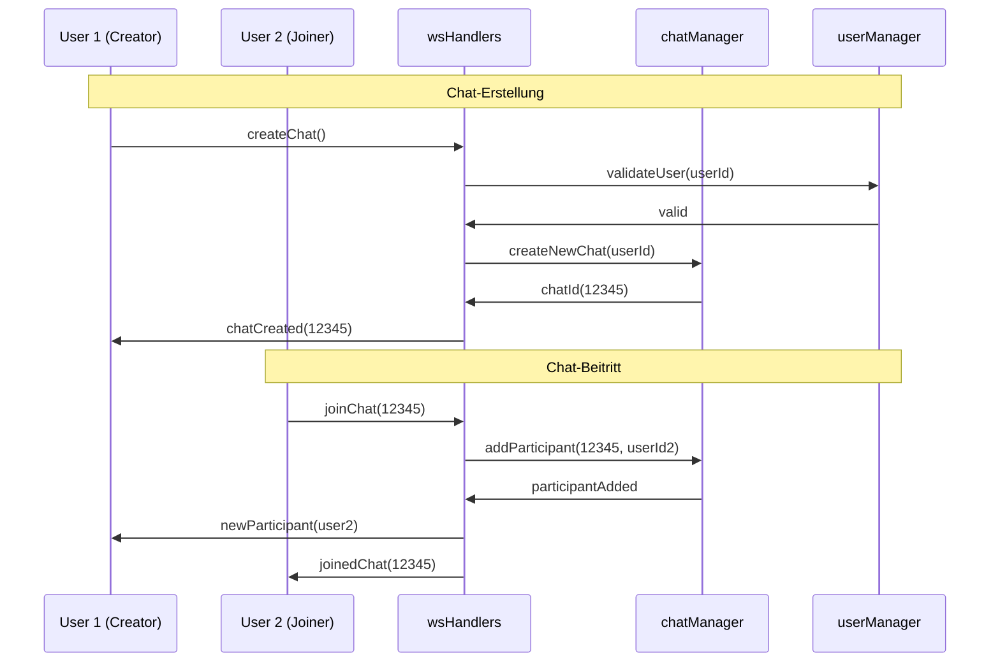
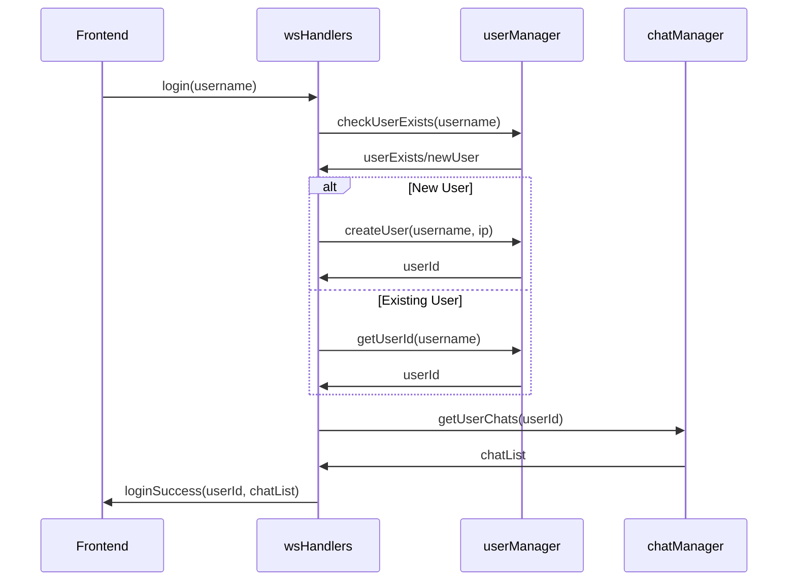
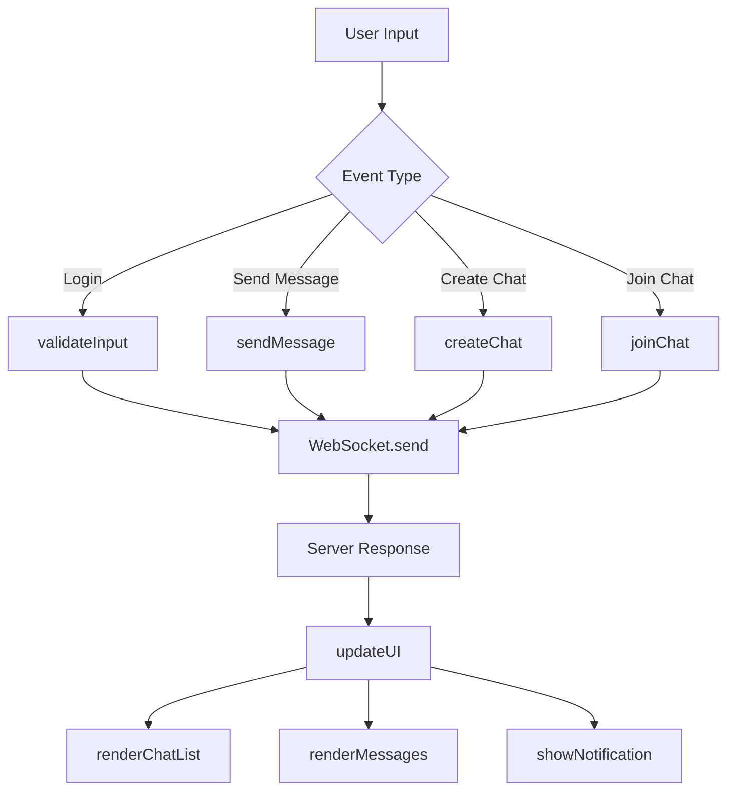
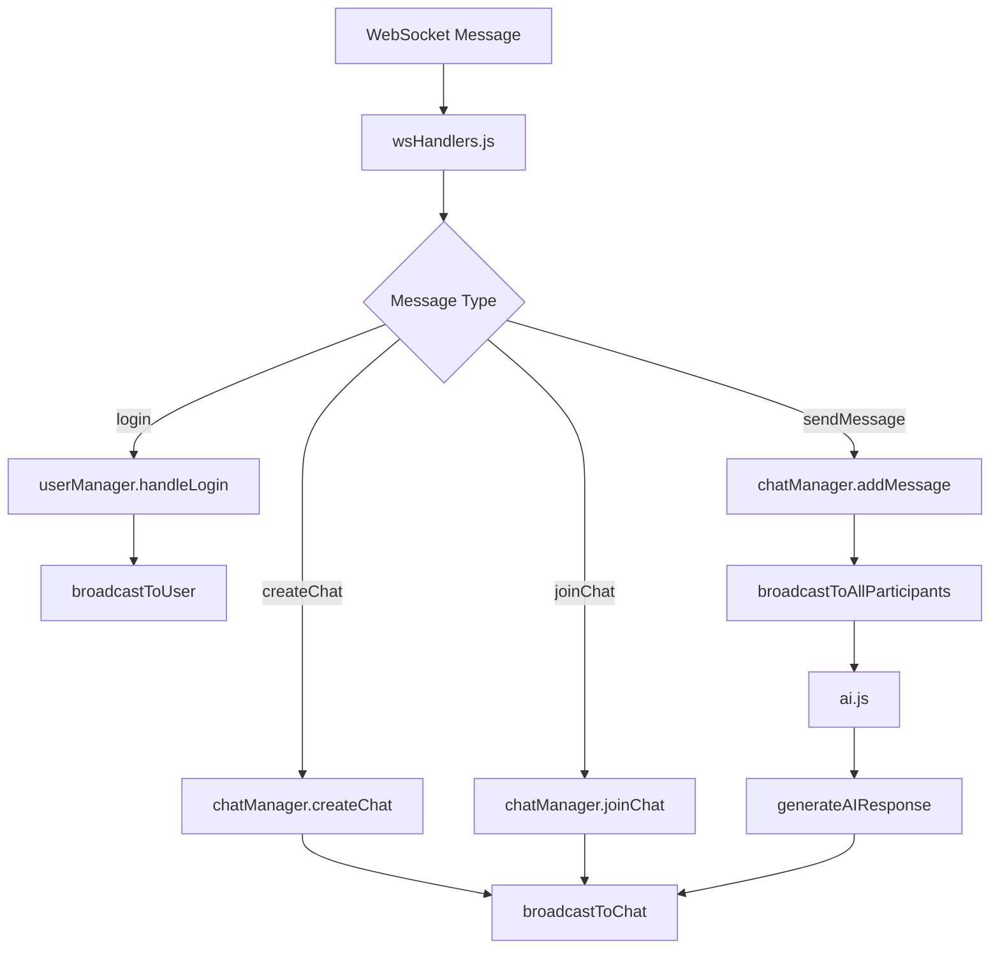
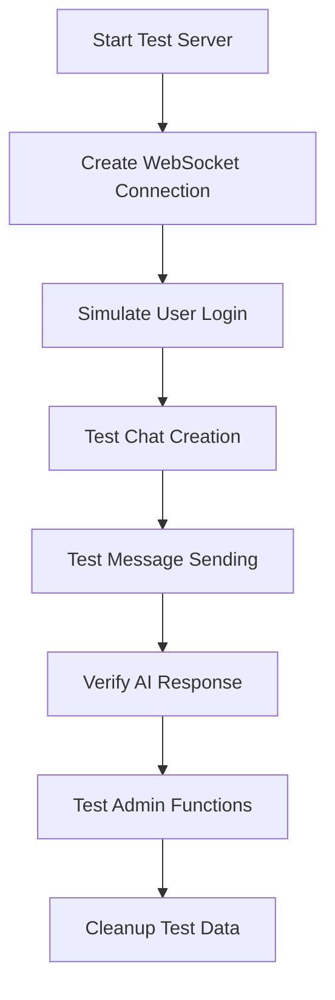
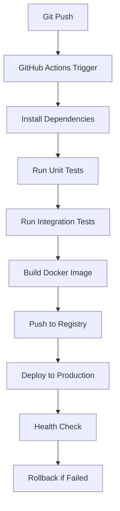

# Chat Tool – Entwicklerdokumentation

## Übersicht

Diese Dokumentation beschreibt die Architektur, Kommunikationsmuster und Sequenzabläufe der Chat-Anwendung. Sie richtet sich an Entwickler, die das System verstehen, erweitern oder debuggen möchten.

---

## Systemarchitektur

### High-Level Architektur

```
┌─────────────────┐    ┌─────────────────┐    ┌─────────────────┐
│   Frontend      │    │   Backend       │    │   External      │
│                 │    │                 │    │                 │
│ ┌─────────────┐ │    │ ┌─────────────┐ │    │ ┌─────────────┐ │
│ │ mein-chat.js│ │◄──►│ │ wsHandlers  │ │    │ │ AI Service  │ │
│ │  (UI/UX)    │ │    │ │  (Router)   │ │    │ │ (Optional)  │ │
│ └─────────────┘ │    │ └─────────────┘ │    │ └─────────────┘ │
│                 │    │        │        │    │                 │
│ ┌─────────────┐ │    │ ┌─────────────┐ │    │                 │
│ │ admin.js    │ │◄──►│ │ chatManager │ │◄──►│                 │
│ │ (Admin UI)  │ │    │ │  (Logic)    │ │    │                 │
│ └─────────────┘ │    │ └─────────────┘ │    │                 │
│                 │    │        │        │    │                 │
│                 │    │ ┌─────────────┐ │    │                 │
│                 │    │ │ userManager │ │    │                 │
│                 │    │ │ (Sessions)  │ │    │                 │
│                 │    │ └─────────────┘ │    │                 │
└─────────────────┘    └─────────────────┘    └─────────────────┘
```

### Komponentenübersicht

| Komponente | Verantwortlichkeit | Kommunikation |
|------------|-------------------|---------------|
| **mein-chat.js** | UI-Rendering, Event-Handling, WebSocket-Client | WebSocket zu wsHandlers |
| **admin.js** | Admin-Interface, Benutzerverwaltung | REST-API zu Express |
| **wsHandlers.js** | WebSocket-Message-Router | WebSocket ↔ Manager-Module |
| **chatManager.js** | Chat-Logik, Nachrichten-Verwaltung | In-Memory Storage |
| **userManager.js** | Benutzer-Sessions, IP-Banning | In-Memory Storage |
| **ai.js** | KI-Integration für Chatbots | HTTP zu externen APIs |

---

## Kommunikationsmuster

### 1. WebSocket-Kommunikation (Frontend ↔ Backend)


### 2. REST-API-Kommunikation (Admin ↔ Backend)



### 3. Interne Modul-Kommunikation



---

## Sequenzdiagramme

### Chat-Erstellung und Beitritt



### Nachrichtenübertragung


### Benutzer-Authentifizierung und Session-Management



---

## Datenstrukturen

### Chat-Datenmodell

```javascript
// In chatManager.js
const chatStructure = {
  chatId: "12345",
  participants: ["user1", "user2"],
  messages: [
    {
      id: "msg1",
      sender: "user1",
      content: "Hello World",
      timestamp: "2024-01-01T10:00:00Z",
      type: "text" // text, system, ai
    }
  ],
  isAiChat: false,
  createdAt: "2024-01-01T09:00:00Z"
}
```

### Benutzer-Datenmodell

```javascript
// In userManager.js
const userStructure = {
  userId: "user123",
  username: "JohnDoe",
  ipAddress: "192.168.1.1",
  joinedAt: "2024-01-01T09:00:00Z",
  isBanned: false,
  activeChats: ["12345", "67890"]
}
```

### WebSocket-Nachrichtenformat

```javascript
// Client → Server
const clientMessage = {
  type: "sendMessage", // createChat, joinChat, sendMessage
  payload: {
    chatId: "12345",
    content: "Hello",
    // ... weitere Daten
  }
}

// Server → Client
const serverMessage = {
  type: "newMessage", // chatCreated, userJoined, messageSent
  payload: {
    chatId: "12345",
    message: {
      sender: "user1",
      content: "Hello",
      timestamp: "2024-01-01T10:00:00Z"
    }
  }
}
```

---

## Event-Flow-Diagramme

### Frontend-Event-Handling



### Backend-Message-Routing



---

## Testing-Strategien

### Unit-Test-Struktur

```javascript
// Beispiel: chatManager.test.js
describe('ChatManager', () => {
  describe('createChat', () => {
    it('should create chat with unique ID', () => {
      // Test Implementation
    });
    
    it('should add creator as participant', () => {
      // Test Implementation
    });
  });
});
```

### Integration-Test-Flow


---

## Deployment-Architektur

### Container-Orchestrierung

```yaml
# docker-compose.yml Beispiel
version: '3.8'
services:
  chat-app:
    build: .
    ports:
      - "3000:3000"
    environment:
      - NODE_ENV=production
    healthcheck:
      test: ["CMD", "curl", "-f", "http://localhost:3000/health"]
      interval: 30s
      timeout: 10s
      retries: 3
```

### CI/CD-Pipeline-Flow


---