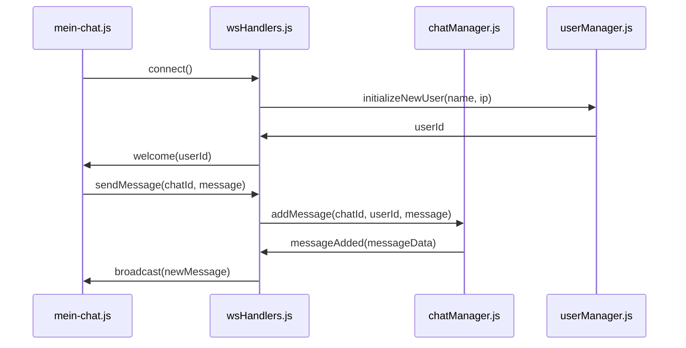
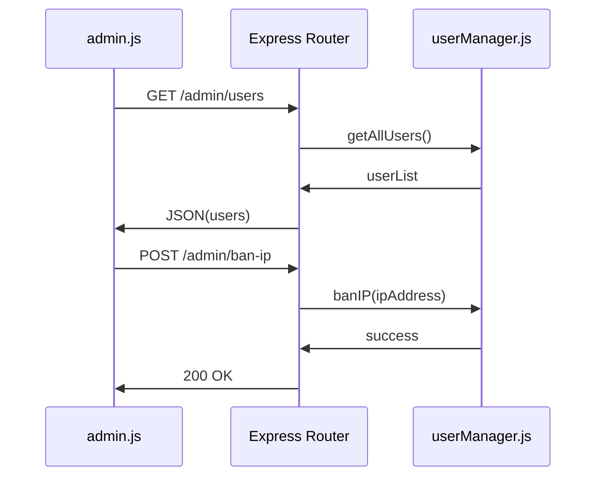
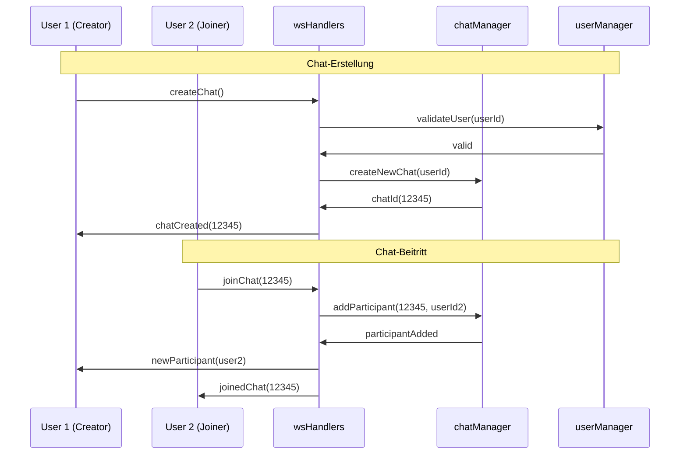
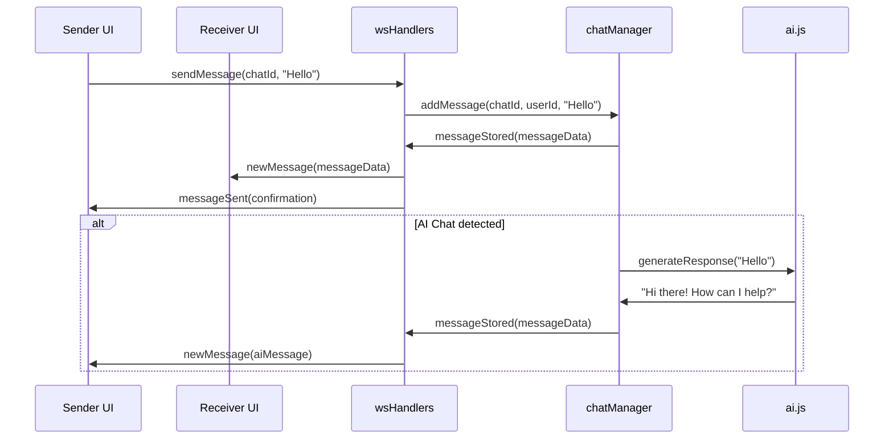
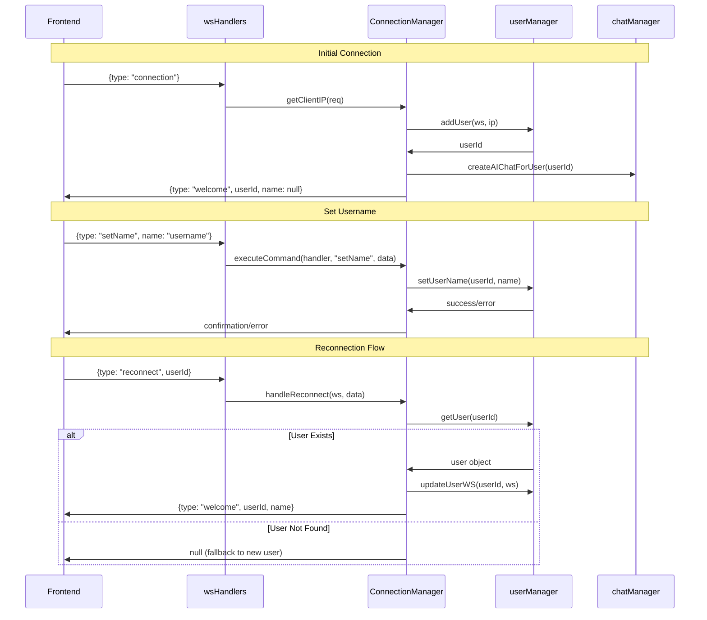

# Chat Tool – Entwicklerdokumentation

## Übersicht

Diese Dokumentation beschreibt die Architektur, Kommunikationsmuster und Sequenzabläufe der Chat-Anwendung. Sie richtet sich an Entwickler, die das System verstehen, erweitern oder debuggen möchten.

---

## Systemarchitektur

### High-Level Architektur

```
┌─────────────────┐    ┌─────────────────┐    ┌─────────────────┐
│   Frontend      │    │   Backend       │    │   External      │
│                 │    │                 │    │                 │
│ ┌─────────────┐ │    │ ┌─────────────┐ │    │ ┌─────────────┐ │
│ │ mein-chat.js│ │◄──►│ │ wsHandlers  │ │    │ │ AI Service  │ │
│ │ (Component)│  │    │ │  (Router)   │ │    │ │ (Optional)  │ │
│ └─────────────┘ │    │ └─────────────┘ │    │ └─────────────┘ │
│                 │    │        │        │    │                 │
│ ┌─────────────┐ │    │ ┌─────────────┐ │    │                 │
│ │    admin    │ │◄──►│ │ chatManager │ │◄──►│                 │
│ │    (Page)   │ │    │ │  (Logic)    │ │    │                 │
│ └─────────────┘ │    │ └─────────────┘ │    │                 │
│                 │    │        │        │    │                 │
│                 │    │ ┌─────────────┐ │    │                 │
│                 │    │ │ userManager │ │    │                 │
│                 │    │ │ (Sessions)  │ │    │                 │
│                 │    │ └─────────────┘ │    │                 │
└─────────────────┘    └─────────────────┘    └─────────────────┘
```

### Komponentenübersicht

| Komponente | Verantwortlichkeit | Kommunikation |
|------------|-------------------|---------------|
| **mein-chat.js** | UI-Rendering, Event-Handling, WebSocket-Client | WebSocket zu wsHandlers |
| **admin.js** | Admin-Interface, Benutzerverwaltung | REST-API zu Express |
| **wsHandlers.js** | WebSocket-Message-Router | WebSocket ↔ Manager-Module |
| **chatManager.js** | Chat-Logik, Nachrichten-Verwaltung | In-Memory Storage |
| **userManager.js** | Benutzer-Sessions, IP-Banning | In-Memory Storage |
| **ai.js** | KI-Integration für Chatbots | HTTP zu externen APIs |

---

## Kommunikationsmuster

### 1. WebSocket-Kommunikation (Frontend ↔ Backend)



### 2. REST-API-Kommunikation (Admin ↔ Backend)



---

## Sequenzdiagramme

### Chat-Erstellung und Beitritt



### Nachrichtenübertragung



### Benutzer-Authentifizierung und Session-Management




## Deployment-Architektur

### CI/CD-Pipeline-Flow


---